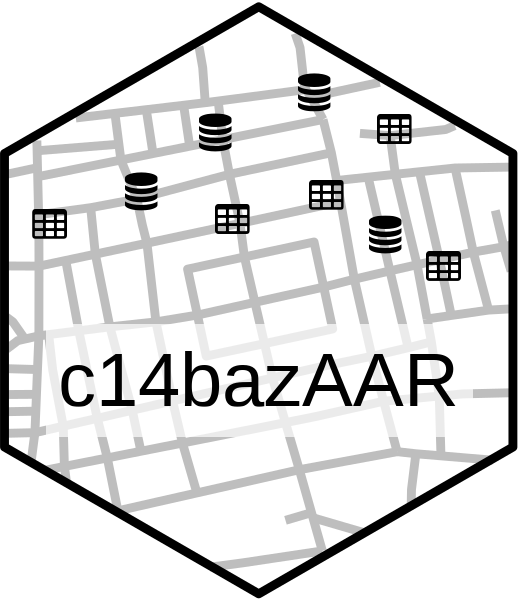
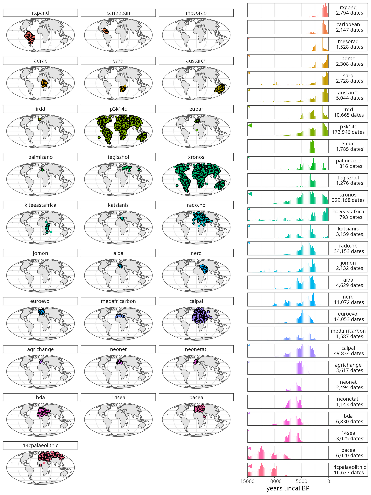

c14bazAAR is an R package to query different openly accessible
radiocarbon date databases. It allows basic data cleaning, calibration
and merging. If you’re not familiar with R other tools (such as
[GoGet](https://www.ibercrono.org/goget/index.php)) to search for
radiocarbon dates might be better suited for your needs.

- [**Installation**](#installation)
- [**How to use**](#how-to-use) ([Download](#download),
  [Calibration](#calibration), [Country
  attribution](#country-attribution), [Duplicates](#duplicates),
  [Conversion](#conversion), [Technical
  functions](#technical-functions), [Plotting and
  visualization](#plotting-radiocarbon-data), [Interaction with other
  radiocarbon data packages](#other-radiocarbon-packages))
- [**Databases**](#databases)
- [**Contributing**](#contributing) ([Adding database getter
  functions](#adding-database-getter-functions), [Pre-submision
  testing](#pre-submision-testing), [Versioning](#versioning))
- [**Citation**](#citation)
- [**License**](#license)

If you want to use data downloaded with c14bazAAR for your research, you
have to cite the respective source databases. Most databases have a
preferred way of citation that also may change over time with new
versions and publications. Please check the [relevant
homepages](#databases) to find out more. The output of c14bazAAR does
not contain the full citations of the individual dates, but only a short
reference tag. For further information you have to consult the source
databases.

### Installation

We recommend to install the stable version from the
[R-universe](https://r-universe.dev/) repository of
[rOpenSci](https://ropensci.org/) with the following command (in your R
console):

    install.packages("c14bazAAR", repos = c(ropensci = "https://ropensci.r-universe.dev"))

The development version can be installed from github with the following
command (in your R console):

    if(!require('remotes')) install.packages('remotes')
    remotes::install_github("ropensci/c14bazAAR")

Both versions are up-to-date and include all databases and features.
Installing the development version on Windows requires the toolchain
bundle [Rtools](https://cran.r-project.org/bin/windows/Rtools/).

The package needs a lot of other packages – many of them only necessary
for specific tasks. Functions that require certain packages you don’t
have installed yet will stop and ask you to enable them. Please do so
with
[`install.packages()`](https://www.r-bloggers.com/installing-r-packages/)
to download and install the respective packages from CRAN.

### How to use

The package contains a set of getter functions (see below) to query the
databases. Thereby not every available variable from every archive is
downloaded. Instead c14bazAAR focuses on a
[selection](https://github.com/ropensci/c14bazAAR/blob/master/data-raw/variable_definition.csv)
of the most important and most common variables to achieve a certain
degree of standardization. The downloaded dates are stored in the custom
S3 class `c14_date_list` which acts as a wrapper around the
[tibble](https://tibble.tidyverse.org/) class and provides specific
class methods.

A workflow to download and prepare all dates could look like this:

    library(c14bazAAR)
    library(magrittr)

    get_c14data("all") %>%
      remove_duplicates() %>%
      calibrate() %>%
      determine_country_by_coordinate()

It takes quite some time to run all of this and it’s probably not
necessary for your use case. Here’s a list of the main tasks c14bazAAR
can handle. That allows you to pick what you need:

#### Download

c14bazAAR contains a growing selection of getter functions to download
radiocarbon date databases. [Here’s](#databases) a list of all available
databases. You can download all dates at once with
[`get_c14data("all")`](https://github.com/ropensci/c14bazAAR/blob/master/R/get_c14data.R).
The getters download the data, adjust the variable selection according
to a defined [variable
key](https://github.com/ropensci/c14bazAAR/blob/master/data-raw/variable_reference.csv)
and transform the resulting list into a `c14_date_list`.

See
[`?get_c14data`](https://docs.ropensci.org/c14bazAAR/reference/db_getter.md)
for more information.

    x <- get_c14data("all")

#### Calibration

The
[`calibrate()`](https://github.com/ropensci/c14bazAAR/blob/master/R/c14_date_list_calibrate.R)
function calibrates all valid dates in a `c14_date_list` individually
with
[`Bchron::BchronCalibrate()`](https://github.com/andrewcparnell/Bchron/blob/master/R/BchronCalibrate.R).
It provides two different types of output: calprobdistr and calrange.

See
[`?calibrate`](https://docs.ropensci.org/c14bazAAR/reference/calibrate.md)
for more information.

    x %>% calibrate()

#### Country attribution

Filtering 14C dates by country is useful for spatial filtering. Most
databases provide the variable country, but they don’t rely on a unified
naming convention and therefore use various terms to represent the same
entity. The function
[`determine_country_by_coordinate()`](https://github.com/ropensci/c14bazAAR/blob/master/R/c14_date_list_spatial_determine_country_by_coordinate.R)
determines the country a date is coming from by intersecting its spatial
coordinates with polygons from
[`rworldxtra::countriesHigh`](https://github.com/AndySouth/rworldxtra).

See
[`?country_attribution`](https://docs.ropensci.org/c14bazAAR/reference/country_attribution.md)
for more information.

    x %>% determine_country_by_coordinate()

#### Duplicates

Some of the source databases already contain duplicated dates and for
sure you’ll have some if you combine different databases. As a result of
the long history of these archives, which includes even mutual
absorption, duplicates make up a significant proportion of combined
datasets. It’s not trivial to find and deal with theses duplicates,
because they are not exactly identical between databases: Sometimes they
are linked to conflicting and mutually exclusive context information.

For an automatic search and removal based on identical lab numbers we
wrote
[`remove_duplicates()`](https://github.com/ropensci/c14bazAAR/blob/master/R/c14_date_list_duplicates_remove.R).
This functions offers several options on how exactly duplicates should
be treated.

If you call
[`remove_duplicates()`](https://docs.ropensci.org/c14bazAAR/reference/duplicates.md)
with the option `mark_only = TRUE` then no data is removed, but you can
inspect the duplicate groups identified.

See
[`?duplicates`](https://docs.ropensci.org/c14bazAAR/reference/duplicates.md)
for more information.

    x %>% remove_duplicates()

#### Conversion

A c14_date_list can be directly converted to other R data structures. So
far only
[`as.sf()`](https://github.com/ropensci/c14bazAAR/blob/master/R/c14_date_list_convert.R)
is implemented. The sf package provides great tools to manipulate and
plot spatial vector data. This simplifies certain spatial operations
with the date point cloud.

See [`?as.sf`](https://docs.ropensci.org/c14bazAAR/reference/as.sf.md)
for more information.

    x %>% as.sf()

#### Technical functions

c14_date_lists are constructed with
[`as.c14_date_list`](https://github.com/ropensci/c14bazAAR/blob/master/R/c14_date_list_basic.R).
This function takes data.frames or tibbles and adds the c14_date_list
class tag. It also calls
[`order_variables()`](https://github.com/ropensci/c14bazAAR/blob/master/R/c14_date_list_order_variables.R)
to establish a certain variable order and
[`enforce_types()`](https://github.com/ropensci/c14bazAAR/blob/master/R/c14_date_list_enforce_types.R)
which converts all variables to the correct data type. There are custom
[`print()`](https://rdrr.io/r/base/print.html),
[`format()`](https://rdrr.io/r/base/format.html) and
[`plot()`](https://rdrr.io/r/graphics/plot.default.html) methods for
c14_date_lists.

The
[`fuse()`](https://github.com/ropensci/c14bazAAR/blob/master/R/c14_date_list_fuse.R)
function allows to rowbind multiple c14_date_lists.

See
[`?as.c14_date_list`](https://docs.ropensci.org/c14bazAAR/reference/c14_date_list.md)
and [`?fuse`](https://docs.ropensci.org/c14bazAAR/reference/fuse.md).

    x1 <- data.frame(
      c14age = 2000,
      c14std = 30
    ) %>% as.c14_date_list()

    x2 <- fuse(x1, x1)

#### Plotting radiocarbon data

c14bazAAR only provides a very basic `plot` function for
`c14_date_list`s. The [simple plotting
vignette](https://github.com/ropensci/c14bazAAR/blob/master/vignettes/simple_plotting.Rmd)
introduces some techniques to help you get started with more
sophisticated visualization.

#### Other radiocarbon packages

There are several R packages that provide functions to calibrate,
analyze or model radiocarbon dates:
e.g. [oxcAAR](https://github.com/ISAAKiel/oxcAAR),
[rcarbon](https://github.com/ahb108/rcarbon),
[Bchron](https://github.com/andrewcparnell/Bchron)

They usually have a simple, vector based interface and you can use
`c14_date_list` columns as input.

    rcarbon::calibrate(x = x$c14age, error = x$c14std)

### Databases

To suggest other archives to be queried you can join the discussion
[here](https://github.com/ropensci/c14bazAAR/issues/2).

[TABLE]

#### Deprecated databases

These databases have been removed from c14bazAAR, because they have been
replaced by newer projects, were discontinued or are just not openly
available any more:

- [**radon**](https://radon.ufg.uni-kiel.de/): Central European and
  Scandinavian database of 14C dates for the Neolithic and Early Bronze
  Age by [Dirk Raetzel-Fabian, Martin Furholt, Martin Hinz, Johannes
  Müller, Christoph Rinne, Karl-Göran Sjögren und Hans-Peter
  Wotzka](https://www.jna.uni-kiel.de/index.php/jna/article/view/65).
- [**radonb**](https://radon-b.ufg.uni-kiel.de/): Database for European
  14C dates for the Bronze and Early Iron Age by Jutta Kneisel, Martin
  Hinz, Christoph Rinne.
- [**context**](http://context-database.uni-koeln.de/): Collection of
  radiocarbon dates from sites in the Near East and neighboring regions
  (20.000 - 5.000 calBC) by Utz Böhner and Daniel Schyle.

### Contributing

If you would like to contribute to this project, please start by reading
our [Guide to
Contributing](https://github.com/ropensci/c14bazAAR/blob/master/CONTRIBUTING.md).
Please note that this project is released with a Contributor [Code of
Conduct](https://github.com/ropensci/c14bazAAR/blob/master/CONDUCT.md).
By participating in this project you agree to abide by its terms.

#### Adding database getter functions

If you want to add another radiocarbon database to c14bazAAR (maybe from
the list [here](https://github.com/ropensci/c14bazAAR/issues/2)) you can
follow this checklist to apply all the necessary changes to the package:

1.  Add your database to the [variable_reference
    table](https://github.com/ropensci/c14bazAAR/blob/master/data-raw/variable_reference.csv)
    and map the database variables to the variables of c14bazAAR and
    other databases.
2.  Write the getter function `get_[The Database Name]` in an own script
    file: **get\_\[the database name\].R**. For the script file names we
    used a lowercase version of the database name. The getter functions
    have a standardized layout and always yield an object of the class
    `c14_date_list`. Please look at some of the available functions to
    get an idea how it is supposed to look like and which checks it has
    to include. Make sure not to store data outside of
    [`tempdir()`](https://rdrr.io/r/base/tempfile.html). Some databases
    include non-radiocarbon dates: Make sure to filter them out –
    c14bazAAR so far only works with radiocarbon dates.
3.  Add the following roxygen2 tags above the function definition to
    include it in the package documentation.

&nbsp;

    #' @rdname db_getter_backend
    #' @export

4.  Update the package documentation with roxygen2.
5.  Add the database url(s) to the [db_info
    table](https://github.com/ropensci/c14bazAAR/blob/master/data-raw/db_info_table.csv)
    to make `get_db_url("[the database name]")` work.
6.  Run the data-raw/data_prep.R script to update the data objects in
    the package. Only this enables the changes made in step 5. You
    should test your changes now by running the respective getter
    function.
7.  Add the getter function your wrote in 2 to the functions vector in
    [`get_all_parser_functions()`](https://github.com/ropensci/c14bazAAR/blob/master/R/get_c14data.R#L128).
8.  Document the addition of the new function in the NEWS.md file.
9.  Add the new database to the list of *Currently available databases*
    in the DESCRIPTION file.
10. Add your function to the database list in the README file
    [here](https://github.com/ropensci/c14bazAAR#databases).
11. Update the README map figure by running the script
    [README_map_figure.R](https://github.com/ropensci/c14bazAAR/blob/master/figures/README_map_figure.R).

#### Pre-submission testing

Before submitting patches or new getter functions via a pull request, we
ask you to check the following items:

1.  The package works and all functions are usable
2.  The package documentation is up-to-date and represents the functions
    correctly
3.  The test coverage of the package functions is sufficient
4.  `DESCRIPTION` is up-to-date with the latest version number and
    database list
5.  `README.md` is up-to-date
6.  `NEWS.md` is up-to-date and includes the latest changes
7.  **Package checks ran and did not yield any ERRORS, WARNINGS or
    NOTES**
8.  Spellcheck with `devtools::spell_check()` ran and did yield not only
    false-positives
9.  codemeta.json is up-to-date (can be updated with
    `codemetar::write_codemeta()`)
10. `inst/CITATION` is up-to-date
11. The package does not make external changes without explicit user
    permission. It does not write to the file system, change options,
    install packages, quit R, send information over the internet, open
    external software, etc.
12. No reverse dependencies break because of the new package version
    (`devtools::revdep_check()`)

#### Versioning

Version numbers (releases) follow the [semantic versioning
schema](https://semver.org/) and consist of mayor and minor releases as
well as patches.

- **x**.y.z: a **mayor** release will be made once an existing function
  is radically changed or removed and thus the package API is changed.
- x.**y**.z: a **minor** release contains new parsers and auxiliary
  functions.
- x.y.**z**: a **patch** updates existing parsers and functions.

### Citation

Schmid et al., (2019). c14bazAAR: An R package for downloading and
preparing C14 dates from different source databases. Journal of Open
Source Software, 4(43), 1914, <https://doi.org/10.21105/joss.01914>

    @Article{Schmid2019,
      title = {{c14bazAAR}: An {R} package for downloading and preparing {C14} dates from different source databases},
      author = {Clemens Schmid and Dirk Seidensticker and Martin Hinz},
      journal = {Journal of Open Source Software},
      volume = {4},
      number = {43},
      pages = {1914},
      month = {nov},
      year = {2019},
      doi = {10.21105/joss.01914},
      url = {https://doi.org/10.21105/joss.01914},
    }

### License

For the code in this project apply the terms and conditions of GNU
GENERAL PUBLIC LICENSE Version 2. The source databases are published
under different licenses.
